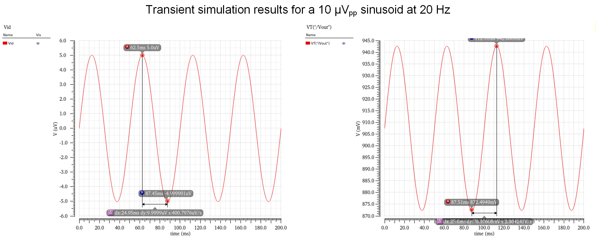

# Two-Stage Folded-Cascode OTA (0.18µm CMOS)

## 📌 1. Project Overview & Specifications
This repository contains the complete design, transistor-level implementation, and verification of a two-stage folded-cascode Operational Transconductance Amplifier (OTA). Designed in a TSMC 0.18µm CMOS process, the OTA drives a 2pF capacitive load. 

The primary engineering challenge was strictly limiting power dissipation to under 2.5mW while securing a DC gain exceeding 70dB and a wide output swing. By abandoning inaccurate square-law approximations in favor of a rigorous **$g_m/I_D$ design methodology**, the final design successfully decoupled critical trade-offs, achieving exceptional efficiency.

### Achieved Performance Metrics
| Parameter | Target Specification | Achieved Result |
| :--- | :--- | :--- |
| **Technology** | 0.18 µm CMOS | 0.18 µm CMOS |
| **Supply Voltage ($V_{DD}$)** | 1.8 V | 1.8 V |
| **Total Power Dissipation** | ≤ 2.5 mW | **1.18 mW** |
| **DC Small-Signal Gain** | ≥ 70 dB | **76.92 dB** |
| **Unity Gain Bandwidth (UGBW)** | ≥ 80 MHz | **86.9 MHz** |
| **Phase Margin (PM)** | ≥ 65° | **70.64°** |
| **Output Common-Mode Range** | 0.4 V – 1.4 V | Meets Spec |

---

## 🏗️ 2. Core Architecture
The topology is a two-stage amplifier comprising a Folded-Cascode first stage and a Common-Source second stage. 

*   **Stage 1 (Folded Cascode):** Provides high intrinsic gain and wide input common-mode range.
*   **Stage 2 (Common-Source):** Maximizes output voltage swing.
*   **Compensation:** Miller compensation with a nulling resistor is employed to ensure closed-loop stability across PVT variations.

---

## 🧠 3. Engineering Methodology: $g_m/I_D$ Sizing
In deep sub-micron nodes (like 0.18µm), velocity saturation and channel-length modulation render traditional square-law equations highly inaccurate, often leading to iterative "SPICE-monkeying". This project utilizes the **$g_m/I_D$ method** to guarantee first-pass design success.

1.  **Current Budgeting ($I_D$):** Current was strategically allocated based on branch function. The input pair required high gain, so it was biased in moderate inversion with a $g_m/I_D$ of 12 S/A, yielding an $I_D$ of $50\mu A$.
2.  **Slewing Prevention:** The folded cascode branches were assigned $60\mu A$ ($1.2 \times I_{D,input}$) to prevent the transistors from slewing during large-signal transients.
3.  **Transistor Sizing via Lookup Tables:** Using MATLAB, precise current densities ($I_D/W$) were extracted from SPICE models for the chosen $g_m/I_D$ values. This allowed direct analytical calculation of transistor widths without blind simulation sweeps.

---

## ⚖️ 4. Design Challenges & Trade-offs

### Trade-off 1: Output Common-Mode Range (OCMR) vs. DC Gain
Meeting the 0.4V lower bound for the OCMR required the output NMOS to have a minimal saturation voltage ($V_{dsat}$). 
*   **The Conflict:** Reducing channel length ($L$) lowers $V_{dsat}$ but drastically degrades output resistance ($r_o$), destroying the amplifier's DC gain. 
*   **The Solution:** The length $L$ was maintained to preserve $r_o$. Instead, the $W/L$ ratio was increased by expanding the width ($W$). Guided by $g_m/I_D$ plots, the exact width was chosen to keep $V_{dsat}$ low enough for the swing while preventing the parasitic capacitance from pushing the secondary pole too low.

### Trade-off 2: Power Dissipation vs. Biasing Stability (Current Scaling)
To crush the 2.5mW power constraint, the static power overhead of the biasing network had to be minimized.
*   A **Constant- $g_m$ reference core** was designed to operate at an ultra-low reference current ($I_{ref}$) of just **11.3µA**.
*   Utilizing **Current Scaling**, multiplicity factors ($m$ factor up to 20) were used to mirror this micro-current up to the main amplifier stages. 
*   **Result:** The entire bias circuit consumes a negligible fraction of the total power, securing a final power consumption of **1.18mW** while fully biasing the high-current signal paths.

**Schematic Details:**

---

## 🎛️ 5. Frequency Compensation
To guarantee a Phase Margin $\ge 65^\circ$, dominant pole compensation was implemented.
*   **Miller Capacitor ($C_c$):** A 0.75pF capacitor splits the poles, setting the dominant pole at the gate of the second stage.
*   **RHP Zero Cancellation:** The Miller effect introduces a Right-Half-Plane (RHP) zero that severely degrades phase margin. An $800\Omega$ nulling resistor ($R_c$) was placed in series with $C_c$ to mathematically push this zero to infinity ($\omega_Z \rightarrow \infty$).

---

## 📈 6. Simulation Results

### AC Response (Bode Plot)
The design achieves a DC gain of 76.92dB and a UGBW of 86.9MHz with a Phase Margin of 70.64°, confirming exceptional small-signal stability.

### Large-Signal Transient Response
Tested with a $10 \mu V_{pp}$ sinusoidal input at 20Hz, confirming linear amplification without distortion.

---
*Designed by Huayu Zhang & Futong Yang for UC San Diego ECE 164 (Analog Integrated Circuit Design).*
